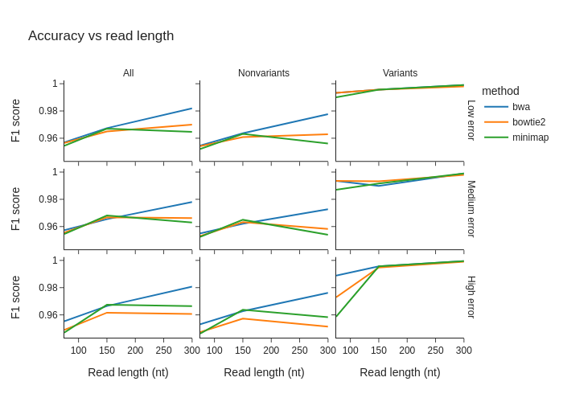

[](https://github.com/ivargr/mapping-benchmarking/actions/workflows/test.yml)
[](https://github.com/ivargr/mapping-benchmarking/blob/benchmarks/reports/main.md)

# Snakemake pipeline for benchmarking read mappers

This is a Snakemake pipeline for benchmarking read mappers. The idea behind this pipeline is:

* It can be used to benchmark new read mappers (no need to spend time writing your own benchmarking scripts if you develop a read mapper). Adding a read mapper should be fairly easy.
* It can be used to get an up-to-date overview of how given read mappers perform on a given type of reads/scenario. This way, we can more easily be up-to-date on how mappers perform, and we can test the specific scenarios we are interested in at any given time. 
* It has been developed with the goal of being easy to clone and run by anyone (Conda is used to avoid any manual installation/setup). It should be fairly straight-forward by anyone  to clone this repository and test read mappers using a configuration of their choice. 
* The aim is also to have automatic benchmarks run frequently on larger data sets, so that one easily can get an overview of how mappers perform on the most common cases without having to run this pipeline. Currently, this runs every night using the latest configurations defined in `config/plots.yml`.

This pipeline is open source, and anyone can contribute (see the Contribute section).


## How to use

### Latest benchmarking results
You will find the latest results [here](https://github.com/ivargr/mapping-benchmarking/blob/benchmarks/reports/main.md). If you want these to include other parameters/settings, feel free to edit the configuration files and make a pull-request (see guide below).

### Run benchmarks locally
1. Install Snakemake and Conda if you havn't already.
2. Clone this repository
3. Install Python requirements: `pip install -r python_requirements.txt` 
4. Run:

You can generate a test report to check that the pipeline is working. This takes about 10 minutes to finish:
```bash
snakemake --use-conda --cores 4 reports/test.md
```

You can generate a specific plot (defined in config/plots.yml)  like this:
```bash
snakemake --use-conda --cores 4 reports/presets/my_plot.png
```

Se guide below for more on how to configure types of runs.


### Contribute 

#### 1) Add a new read-mapper
See *Add a new read-mapper* under *Developer guide*.

#### 2) Add plots/cases
All plots are specified in `config/plots.yaml`. For any plots that rely on already implemented parameters and result types (as defined in `config/config.yaml`), no code is necesary, and the plots can be defined and built only by configuring them in `config/plot.yml`. 
Feel free to edit that file to add plots you believe are useful, and make a pull request. See Developer guide for how this configuration works. 

#### 3) General help/contribution
This is a simple first attempt at a pipeline that tries to be flexible and allow benchmarking across what we think are the relevant parameters. However, we want this pipeline to be shaped by what the community believe is important. Feel free to open an issue to discuss things that can be changed or added, e.g. cases or benchmarks that are not currently supported.


## Developer guide

### Creating a plot

This pipeline follows the Snakemake principles, meaning that the user defines what the final result should be, and then the pipeline tries to run the necessary jobs for creating that output. For instance, you can ask for a plot where the x-axis is something, the y-axis is something and the pipeline will try to run what is needed to generate that plot. "Something" needs to be a valid *parameter* or *result_type*. For instance, the x-axis could be `method` (i.e. read mapper) and the y-axis can be `memory_usage` and the pipeline will then run all methods and capture the memory usage and present that.

You can add a plot type by adding a configuration under `plot_types` in `config/plots.yaml`. Example:

```yaml
plot_types:
  accuracy_vs_read_length:
    type: line
    x: read_length
    y: f1_score
    color: method
    facet_col: variant_filter
    facet_row: error_profile
```

The above defines a plot type with the name `accuracy_vs_read_length`. We tell the pipeline to make a plot type where the x-axis is `read_length` and the y-axis is `f1_score`. The "color" is `method`, which means that we want one line for each available method (color is the term that **Plotly** uses). We want to repeat this plot for different "variant_filters" along the columns (specified by `facet_col`) and for different error profiles along the rows (specified by `facet_row`). Note that only `x` and `y` are mandatory, the rest can be ommited (in that case only a single plot is created).

The above **only** specifies a **plot_type**, not a plot. For instance, we say that the x-axis should have `method`, but we don't tell it *which* methods to include. Using this plot type, we can specify actual plots with data, under the `plots`-section in the same YAML-file:

```yaml
plots:
  my_plot:
    plot_type: accuracy_vs_read_length
```

We can now ask Snakemake to generate my_plot:

```bash
snakemake reports/presets/my_plot.png
```
.. which should create something like this:



Note that running the above will generate a plot with **default values** for all variables (method, read length etc). This is because no parameters were specified. The default values are specified in `config/config.yaml`. For instance, the default `parameter_set` for read length is `[75, 150, 300]`, specified with the `read_lengths_rough` name. The default individual is `hg002`. If you want to change any of the defaults, you can easily do that. 
Example: 

```yaml
plots:
  my_plot:
    plot_type: accuracy_vs_read_length
    parameters:
      min_mapq: 30
      individual: hg003
```

Now, if creating `my_plot` it will be run for hg003 and not hg002 which is the default. The minimum mapq for reads considered will be 30 (not 0 which is the default value).

Se `result_types` and `parameter_types` in `config/config.yaml` for a list of valid paramters and results that can be used to generate plots. As long as your plot is defined in terms of these, you can generate any plot by only writing the configuration for the plot.

### Adding a read mapper

Read-mappers that are not currently listed in config.yaml can be added. Follow these steps below. We assume you already have some experience with writing Snakemake rules, if not check out the Snakemake documentation first.

1. Add the mapper to the `method` and `all_methods` lists in `config/config.yaml`
2. Create a `.smk` file in rules for the mapper (e.g. `bwa.smk`)
3. Implement rules for running single-end and paired-end read mapping. This can e.g. be done using two rules: `NAME_map_single_end` and `NAME_map_paired_end` (replace NAME with the mapper ID, e.g. `bwa`). As input to the single-end rule, you can use the function `single_end_reads` and for the paired-enr-rule, you can use the function `paired_end_reads`. Se the rules in `rules/bowtie2.yml` for a good example of how to do this. 
4. The rules can also take an index as input if that is needed, you will then need to implement a rule for creating the index (see the `bwa_index` rule for reference).
5. As output, the rules should produce this bam-file: `{data}/whole_genome_single_end/[...]/NAME/{n_threads}/mapped.bam`. This path contains a lot of parameters, so we have implemented some Python code to generate the path (see the bowtie-rule for reference, and change bowtie to your mapper).
6. The rule should use the `n_threads` wildcard as a parameter to specify number of threads. 
7. Either use a Snakemake wrapper or specify a conda-environment for the rule. Nothing should be needed to be installed manually. Note that some Snakemake wrappers do not use the `n_threads` parameter correctly (e.g. the BWA MEM and bowtie wrappers). If that is the case, you need to implement the run-command yourself and use a conda environment.

### Add a new read type
Reads are currently simulated using ART in the rule `simulate_reads_for_chromosome_and_haplotype` but any tool that is able to take a fasta file (reference) and produce simulated reads and truth positions of those reads will work. There are also rules using Mason instead of ART, but from our experience ART is much faster.

The idea behind read simulation is currently that two haploid references are created and that reads are simulated independently on those. The truth positions are then "translated" to the real reference genome coordinates. This is a bit complicated, and not how read simulation is normally done, but this lets us simulate from a diploid genome and do benchmarking of variant calling and genotyping since we can have heterozygous variants. All the conversion of coordinates is taken care of as long as the read simulation rule outputs the correct files.

The pipeline does currently not support long read sequences, but this could be included by and named `whole_genome_long_reads` for the parameter called `read_type` with a rule similar to `simulate_reads_for_chromosome_and_haplotype`. 