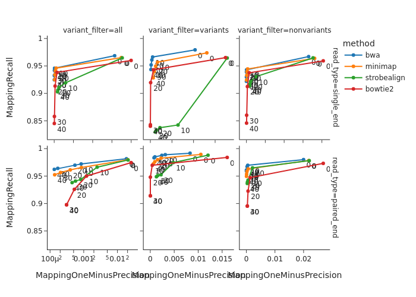

# Report, created  2023-04-12 08:18

Note: This pipeline is under development, and the results may be wrong or inaccurate.

## Accuracy vs read length

Accuracy is measured as the F1 score and shown for different read lengths and single/paired end reads. Further divided into reads containing and not containing genomic variants. A read contains a variant is it has been simulated so that it contains a variant allele not in the reference genome.

 

 [Link to plot data](../plots/f1_score_vs_read_length.md) 

## Precision/recall for various MAPQ thresholds

Recall and 1-Precision is shown for different subsets of the reads, depending on the MAPQ-score (shown as dots in the plot). For every MAPQ-score, only reads with that score or higher are included.

 

 [Link to plot data](../plots/accuracy_for_various_mapq_thresholds_human_whole_genome.md) 

## Accuracy for different error profiles

Showing read mapping accuracy for reads simulated with different error profiles (here described as low, medium and high error rate).

 

 [Link to plot data](../plots/accuracy_vs_read_length_and_error_profile_human_whole_genome.md) 

## Variant calling accuracy

 

 [Link to plot data](../plots/variant_calling_accuracy_vs_mapq_threshold.md) 

## Peak calling accuracy

Peaks are simulated using Chips. The accuracy is the number of peaks found after calling peaks by MACS and selecting the top N peaks where N is the same number of peaks as in the simulated data.

 

 [Link to plot data](../plots/peak_calling_accuracy_vs_read_length_human.md) 

## Runtime as a function of number of threads used

Shown for single-end and paired-end reads and different read lengths.

 

 [Link to plot data](../plots/runtime_human_whole_genome.md) 

## Memory usage

Memory usage when mapping 2 million reads using 4 threads to hg38.

 

 [Link to plot data](../plots/memory_human_whole_genome.md) 

